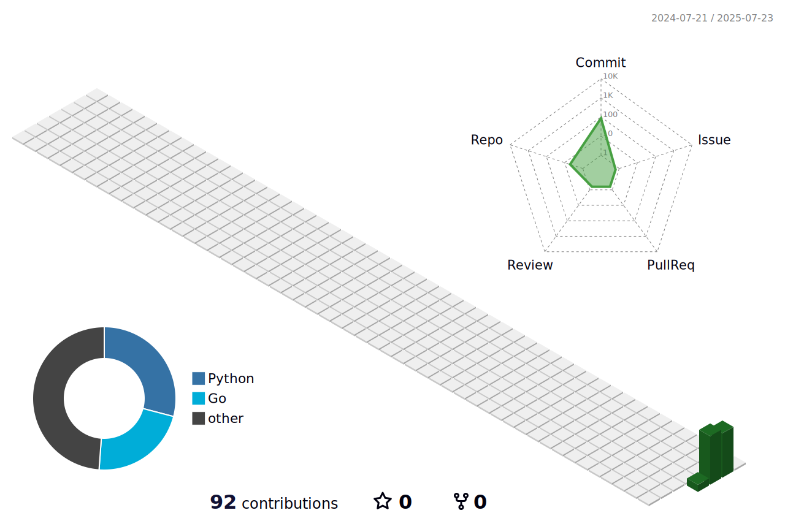

## Hi there 👋

<!--
**tinde29/tinde29** is a ✨ _special_ ✨ repository because its `README.md` (this file) appears on your GitHub profile.

Here are some ideas to get you started:

- 🔭 I’m currently working on ...
- 🌱 I’m currently learning ...
- 👯 I’m looking to collaborate on ...
- 🤔 I’m looking for help with ...
- 💬 Ask me about ...
- 📫 How to reach me: ...
- 😄 Pronouns: ...
- ⚡ Fun fact: ...
-->

GitHub Profile
## My Contribution Graphs

  

<table>
  <tr>
    <td align="center" width="96">
      
    </td>
    <td align="center" width="96">
      
    </td>
    <td align="center" width="96">
      
    </td>
    <td align="center" width="96">
      
    </td>
    <td align="center" width="96">
      
    </td>
    <td align="center" width="96">
      
    </td>
    <td align="center" width="96">
      
    </td>
    <td align="center" width="96">
      
    </td>
    <td align="center" width="96">
      
    </td>
    <td align="center" width="96">
      
    </td>
  </tr>
</table>

  <!-- کادر اول: مثلاً GitHub Stats -->
  

    <h3>📊 آمار گیت‌هاب</h3>
    
  

  
  <!-- کادر دوم: مثلاً Top Languages -->
  

    <h3>💻 زبان‌های برتر</h3>
    
  

  <picture>
    <source media="(prefers-color-scheme: dark)" srcset="profile-3d-contrib/dark-theme.svg">
    <source media="(prefers-color-scheme: light)" srcset="profile-3d-contrib/light-theme.svg">
    
  </picture>

